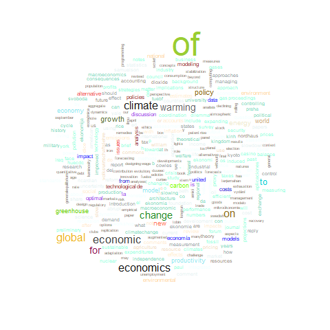
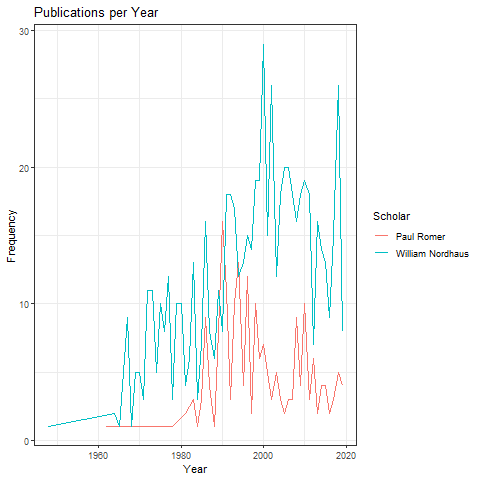
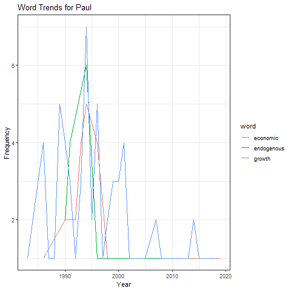
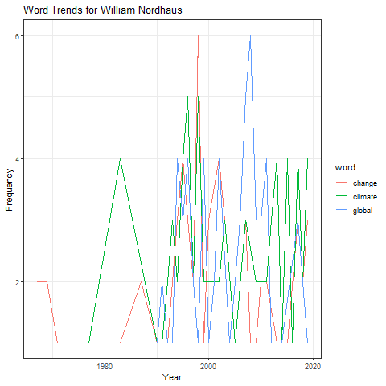

```{r setup, include=FALSE}
knitr::opts_chunk$set(echo = TRUE)
```

```{r}
library(dplyr)
library(stringr)
library(ggplot2)
library(tm)
library(wordcloud)
library(readr)

paul_romer_df <- read.csv("../data/cleandata/paul_romer_GoogleScholarCitations.csv", stringsAsFactors = FALSE)
william_nordhaus_df <- read.csv("../data/cleandata/william_nordhaus_GoogleScholarCitations.csv", stringsAsFactors = FALSE)
```

```{r}
#Start with a vowel

vowels = c("A", "E", "I", "O", "U")
beginningvowel_paul = 0
firstletters_paul = c()
for (i in 1:nrow(paul_romer_df)){
  firstletters_paul <- append(firstletters_paul, toupper(substr(paul_romer_df[i,1], 1, 1)))
}
for (i in 1:length(vowels)){
  beginningvowel_paul = beginningvowel_paul + as.numeric(table(firstletters_paul)[vowels[i]])
}

beginningvowel_william = 0
firstletters_william = c()
for (i in 1:nrow(william_nordhaus_df)){
  firstletters_william <- append(firstletters_william, toupper(substr(william_nordhaus_df[i,1], 1, 1)))
}
for (i in 1:length(vowels)){
  beginningvowel_william = beginningvowel_william + as.numeric(table(firstletters_william)[vowels[i]])
}
beginningvowel_paul
beginningvowel_william
```
For Paul Romer, 72 of his titles start with a vowel. For William Nordhaus, 242 of his titles start with a vowel, likely because he has many more papers published.

```{r}
#End with 's'

lastletters_paul <- c()
for (i in 1:nrow(paul_romer_df)){
  lastletters_paul <- append(lastletters_paul, toupper(substr(paul_romer_df[i,1], nchar(as.vector(paul_romer_df[i,1])), nchar(as.vector(paul_romer_df[i,1])))))
}
as.numeric(table(lastletters_paul)["S"])

lastletters_william <- c()
for (i in 1:nrow(william_nordhaus_df)){
  lastletters_william <- append(lastletters_william, toupper(substr(william_nordhaus_df[i,1], nchar(as.vector(william_nordhaus_df[i,1])), nchar(as.vector(william_nordhaus_df[i,1])))))
}
as.numeric(table(lastletters_william)["S"])
```
For Paul Romer, 44 of his titles end with an "s". For William Nordhaus, 133 of his titles end with an "s", likely because he has many more papers published.

```{r}
# longest paper title excluding languages whose characters are symbols

paul_title_lengths <- c()
for (i in 1:nrow(paul_romer_df)){
  paul_title_lengths[i] <- nchar(as.vector(paul_romer_df[i,1]))
}
paul_title_lengths_sorted <- sort(paul_title_lengths, decreasing = TRUE)
top_5_paul <- match(paul_title_lengths_sorted[1:5], paul_title_lengths)
paul_romer_df[top_5_paul,1]
## from the data, the 3rd title out of the top 5 is the longest valid title
longest_title_paul <- paul_romer_df[top_5_paul[3],1]

william_title_lengths <- c()
for (i in 1:nrow(william_nordhaus_df)){
  william_title_lengths[i] <- nchar(as.vector(william_nordhaus_df[i,1]))
}
william_title_lengths_sorted <- sort(william_title_lengths, decreasing = TRUE)
top_5_william <- match(william_title_lengths_sorted[1:5], william_title_lengths)
william_nordhaus_df[top_5_william,1]
## from the data, the 3rd title out of the top 5 is the longest valid title
longest_title_william <- william_nordhaus_df[top_5_william[3],1]
```
```{r}
longest_title_paul
longest_title_william
```
The longest title of Paul Romer is shorter than the longest title of William Nordhaus. Nordhaus' longest title isn't fully written into the website data table because it's very long.

```{r}
# calculating number of punctuation symbols in titles

number_of_punctuation_symbols_paul <- c()
for (i in 1:nrow(paul_romer_df)){
  number_of_punctuation_symbols_paul[i] <- str_count(paul_romer_df[i,1], pattern = "[[:punct:]]+")
}

number_of_punctuation_symbols_william <- c()
for (i in 1:nrow(william_nordhaus_df)){
  number_of_punctuation_symbols_william[i] <- str_count(william_nordhaus_df[i,1], pattern = "[[:punct:]]+")
}

#Paul Romer punctuation summary data
summary(number_of_punctuation_symbols_paul)

#William Nordhaus punctuation summary data
summary(number_of_punctuation_symbols_william)

barplot(table(number_of_punctuation_symbols_paul), main = "Histogram of Punctuation Symbols in Paul Romer Titles", xlab = "number of symbols", ylab = "frequency", ylim = c(0,100))

barplot(table(number_of_punctuation_symbols_william), main = "Histogram of Punctuation Symbols in William Nordhaus Titles", xlab = "number of symbols", ylab = "frequency", ylim = c(0,300))
```
William Nordhaus has more symbols in his titles than Paul Romer but the distribution they both follow is very similar, exponentially decreasing as symbols increase.

```{r}
# Removing stop words, punctuations and numbers from titles and making all titles lowercase for ease of manipulation later on

stopwords = c("\\bthe\\b", "\\ba\\b", "\\ban\\b", "\\band\\b", "\\bin\\b", "\\bif\\b", "\\bbut\\b")

paperName_edited_paul <- c()
for (i in 1:nrow(paul_romer_df)){
  paperName_edited_paul[i] <- removeWords(tolower(gsub(pattern = "[[:digit:]]+|[[:punct:]]+", replacement = "", x = paul_romer_df[i,1])), stopwords)
}
#paperName_edited_paul

paperName_edited_william <- c()
for (i in 1:nrow(william_nordhaus_df)){
  paperName_edited_william[i] <- removeWords(tolower(gsub(pattern = "[[:digit:]]+|[[:punct:]]+", replacement = "", x = william_nordhaus_df[i,1])), stopwords)
}
#paperName_edited_william
```

```{r}
# counting frequency of words in Paul Romer titles

words_paul <- c()
for (i in 1:length(paperName_edited_paul)){
  words_paul <- append(words_paul, strsplit(paperName_edited_paul[i], " ")[[1]])
}

words_sorted_paul <- sort(table(words_paul), decreasing = TRUE)
## after viewing words_sorted_paul, the blank spaces are the most common and so they are going to be removed from the top 10 and replaced.

words_sorted_paul <- as.data.frame((words_sorted_paul))[2:length(words_sorted_paul), ]
rownames(words_sorted_paul) <- c()
colnames(words_sorted_paul) <- c("words", "frequency")

# top 10 most used words for Paul Romer
head(words_sorted_paul, 10)
```
These are the 10 most frequent words in Paul Romer's titles.

```{r}
# counting frequency of words in William Nordhaus titles

words_william <- c()
for (i in 1:length(paperName_edited_william)){
  words_william <- append(words_william, strsplit(paperName_edited_william[i], " ")[[1]])
}

words_sorted_william <- sort(table(words_william), decreasing = TRUE)
## after viewing words_sorted_william, the blank spaces are the most common and so they are going to be removed from the top 10 and replaced.

words_sorted_william <- as.data.frame((words_sorted_william))[2:length(words_sorted_william), ]
rownames(words_sorted_william) <- c()
colnames(words_sorted_william) <- c("words", "frequency")

# top 10 most used words for Paul Romer
head(words_sorted_william, 10)
```
These are William Nordhaus' top 10 words. "Of" and "economic" both show up in the top 3 for both authors.

```{r include = FALSE}
# making wordcloud for Paul Romer

png(filename = "../images/wordcloud_paul_romer.png")
wordcloud(words_sorted_paul$words, words_sorted_paul$frequency, scale = c(4, 0.5), random.color = FALSE, colors = colors())
dev.off()

# making wordcloud for William Nordhaus

png(filename = "../images/wordcloud_william_nordhaus.png")
wordcloud(words_sorted_william$words, words_sorted_william$frequency, scale = c(4, 0.5), random.color = FALSE, colors = colors())
dev.off()
```

```{r echo = FALSE, fig.align='center'}

```
The wordcloud for Paul Romer shows that very few words are used very frequently while most words are used around the same number of times.

```{r echo = FALSE, fig.align='center'}

```
The wordcloud for William Nordhaus shows that very few words are used very frequently while most words are used around the same number of times. The distribution of frequency of words used is very similar for both authors.

```{r include = FALSE}
# making plot of publications per year

yearly_papers_paul <- as.data.frame(table(paul_romer_df$year))
yearly_papers_william <- as.data.frame(table(william_nordhaus_df$year))

yearly_papers_df <- rbind.data.frame(yearly_papers_paul, yearly_papers_william)
scholars_paul <- rep("Paul Romer", nrow(yearly_papers_paul))
scholars_william <- rep("William Nordhaus", nrow(yearly_papers_william))
scholars <- c(scholars_paul, scholars_william)
yearly_papers_df <- cbind.data.frame(yearly_papers_df, scholars)
colnames(yearly_papers_df) <- c("Year", "Frequency", "Scholar")

yearly_papers_df$Year <- as.numeric(levels(yearly_papers_df$Year))[yearly_papers_df$Year]

png(filename = "../images/publications_per_year.png")
ggplot(data = yearly_papers_df, aes(x = Year, y = Frequency, group = Scholar)) + geom_line(aes(color = Scholar)) + ggtitle("Publications per Year") + theme_bw()
dev.off()
```

```{r echo = FALSE, fig.align='center'}

```
William Nordhaus began publishing papers much earlier than Paul Romer. Both authors have steadily increased the numbers of paper published per year until a point where the papers published started decreasing. There are multiple peaks every 10 years or so. Nordhaus published the most papers in 2000 while Romer's highest was 1990. Nordhaus exceeded Romer in papers published almost every year.

```{r include = FALSE}
# Selecting 3 words from top 10 of each author
## Paul Romer - growth, economic, endogenous
## William Nordhaus -  climate, global, change

growth_in_paul <- str_detect(paperName_edited_paul, pattern = "\\bgrowth\\b")
economic_in_paul <- str_detect(paperName_edited_paul, pattern = "\\beconomic\\b")
endogenous_in_paul <- str_detect(paperName_edited_paul, pattern = "\\bendogenous\\b")
growth_years_paul <- c()
economic_years_paul <- c()
endogenous_years_paul <- c()

for (i in 1:length(paperName_edited_paul)){
  if (growth_in_paul[i] == TRUE){
    growth_years_paul <- append(growth_years_paul, paul_romer_df$year[i])
  }
  if (economic_in_paul[i] == TRUE){
    economic_years_paul <- append(economic_years_paul, paul_romer_df$year[i])
  }
  if (endogenous_in_paul[i] == TRUE){
    endogenous_years_paul <- append(endogenous_years_paul, paul_romer_df$year[i])
  }
}

climate_in_william <- str_detect(paperName_edited_william, pattern = "\\bclimate\\b")
global_in_william <- str_detect(paperName_edited_william, pattern = "\\bglobal\\b")
change_in_william <- str_detect(paperName_edited_william, pattern = "\\bchange\\b")
climate_years_william <- c()
global_years_william <- c()
change_years_william <- c()

for (i in 1:length(paperName_edited_william)){
  if (climate_in_william[i] == TRUE){
    climate_years_william <- append(climate_years_william, william_nordhaus_df$year[i])
  }
  if (global_in_william[i] == TRUE){
    global_years_william <- append(global_years_william, william_nordhaus_df$year[i])
  }
  if (change_in_william[i] == TRUE){
    change_years_william <- append(change_years_william, william_nordhaus_df$year[i])
  }
}

growth_years_paul <- as.data.frame(table(growth_years_paul))
colnames(growth_years_paul) <- c("Year", "Frequency")
economic_years_paul <- as.data.frame(table(economic_years_paul))
colnames(economic_years_paul) <- c("Year", "Frequency")
endogenous_years_paul <- as.data.frame(table(endogenous_years_paul))
colnames(endogenous_years_paul) <- c("Year", "Frequency")
climate_years_william <- as.data.frame(table(climate_years_william))
colnames(climate_years_william) <- c("Year", "Frequency")
global_years_william <- as.data.frame(table(global_years_william))
colnames(global_years_william) <- c("Year", "Frequency")
change_years_william <- as.data.frame(table(change_years_william))
colnames(change_years_william) <- c("Year", "Frequency")

word <- c(rep("growth", nrow(growth_years_paul)), rep("economic", nrow(economic_years_paul)), rep("endogenous", nrow(endogenous_years_paul)))

word_usage_df_paul <- rbind.data.frame(growth_years_paul, economic_years_paul, endogenous_years_paul)

word_usage_df_paul <- cbind.data.frame(word_usage_df_paul, word)

word_usage_df_paul$Year <- as.numeric(levels(word_usage_df_paul$Year))[word_usage_df_paul$Year]

word <- c(rep("climate", nrow(climate_years_william)), rep("global", nrow(global_years_william)), rep("change", nrow(change_years_william)))

word_usage_df_william <- rbind.data.frame(climate_years_william, global_years_william, change_years_william)

word_usage_df_william <- cbind.data.frame(word_usage_df_william, word)

word_usage_df_william$Year <- as.numeric(levels(word_usage_df_william$Year))[word_usage_df_william$Year]

png(filename = "../images/word_trends_romer.png")
ggplot(data = word_usage_df_paul, aes(x = Year, y = Frequency, group = word)) + geom_line(aes(color = word)) + ggtitle("Word Trends for Paul") + theme_bw()
dev.off()

png(filename = "../images/word_trends_nordhaus.png")
ggplot(data = word_usage_df_william, aes(x = Year, y = Frequency, group = word)) + geom_line(aes(color = word)) + ggtitle("Word Trends for William Nordhaus") + theme_bw()
dev.off()
```

```{r echo = FALSE, fig.align='center'}

```
Paul Romer's use of three buzzwords "economic", "growth" and "endogenous", spiked repeatedly until 1994 after which the use of these words tailed off. The highest frequency of all words in the graph was "growth" which was used 7 times in 1994.

```{r echo = FALSE, fig.align='center'}

```
William Nordhaus would use a word around 4 times per year in his titles. The highest frequency of all words in the graph was "change" and "global", both used 6 times at their peak. The word usage for Nordhaus shows more activity 1995 onwards.

```{r}
# counting number of co-authors for Paul Romer

total_coauthors_paul <- 0

for (i in 1:nrow(paul_romer_df)){
  total_coauthors_paul <- total_coauthors_paul + str_count(paul_romer_df$researcher[i], pattern = ",")
}

mean_coauthors_paul <- total_coauthors_paul/nrow(paul_romer_df)
mean_coauthors_paul
```

```{r}
# counting number of co-authors for William Nordhaus

total_coauthors_william <- 0

for (i in 1:nrow(william_nordhaus_df)){
  total_coauthors_william <- total_coauthors_william + str_count(william_nordhaus_df$researcher[i], pattern = ",")
}

mean_coauthors_william <- total_coauthors_william/nrow(william_nordhaus_df)
mean_coauthors_william
```
On average, Paul Romer edges out William Nordhaus when it comes to average number of coauthors which could show that Romer is more willing to work with other researchers than Nordhaus.

```{r}
# Checking if the two authors have worked together on a paper

paul_and_william <- str_detect(paul_romer_df$researcher, pattern = "\\bNordhaus\\b")

paul_and_william_papers <- paul_romer_df[which(paul_and_william %in% TRUE),]
paul_and_william_papers
```
The two authors have, in fact, worked together on research in the past.

```{r}
# paper with the most coauthors for Paul Romer

number_of_coauthors_paul <- c()

for (i in 1:nrow(paul_romer_df)){
  number_of_coauthors_paul[i] <- str_count(paul_romer_df$researcher[i], pattern = ",")
}

paul_romer_df[which.max(number_of_coauthors_paul), ]
```
This is Paul Romer's paper in which he had the most coauthors.

```{r}
# paper with the most coauthors for William Nordhaus

number_of_coauthors_william <- c()

for (i in 1:nrow(william_nordhaus_df)){
  number_of_coauthors_william[i] <- str_count(william_nordhaus_df$researcher[i], pattern = ",")
}

william_nordhaus_df[which.max(number_of_coauthors_william), ]
```
This is William Nordhaus' paper in which he had the most coauthors.

```{r}
# number of distinct journals in Paul Romer table

journal_paul_logical <- str_detect(toupper(paul_romer_df$journal), pattern = "\\bJOURNAL\\b")

number_of_unique_journals_paul <- length(unique(paul_romer_df$journal[which(journal_paul_logical %in% TRUE)]))
number_of_unique_journals_paul
```

```{r}
# number of distinct journals in William Nordhaus table

journal_william_logical <- str_detect(toupper(william_nordhaus_df$journal), pattern = "\\bJOURNAL\\b")

number_of_unique_journals_william <- length(unique(william_nordhaus_df$journal[which(journal_william_logical %in% TRUE)]))
number_of_unique_journals_william
```
Paul Romer is published in 42 different journals. William Nordhaus is published in 64 different journals. This could show a broader level of expertise for Nordhaus as he is published in many more different journals that could span slightly different topics and fields.

```{r}
# citations for each journal - Paul Romer

journals_paul_df <- paul_romer_df[which(journal_paul_logical %in% TRUE),]
journals_paul_df$journal <- factor(journals_paul_df$journal)
journals_paul_df_citations <- summarise(group_by(journals_paul_df, journal), total_citations = sum(citations, na.rm = FALSE))

journals_paul_df_citations
```
These are Romer's citation counts for each journal. Some are NA as there is no data on the citation number for these journals.

```{r}
# citations for each journal - William Nordhaus

journals_william_df <- william_nordhaus_df[which(journal_william_logical %in% TRUE),]
journals_william_df$journal <- factor(journals_william_df$journal)
journals_william_df_citations <- summarise(group_by(journals_william_df, journal), total_citations = sum(citations, na.rm = FALSE))

journals_william_df_citations
```
These are Nordhaus' citation counts for each journal. Some are NA as there is no data on the citation number for these journals.

```{r}
# most influential journal

arrange(journals_paul_df_citations, desc(total_citations))
arrange(journals_william_df_citations, desc(total_citations))
```
In their academic field, for Romer, the "Journal of Political Economy" is the most influential as it attains the top two spots. For Nordhaus, "The Energy Journal" attains two of the top 5 spots and is repeatedly cited in different volumes later on and so it is the most influential.
