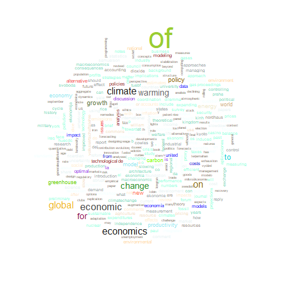
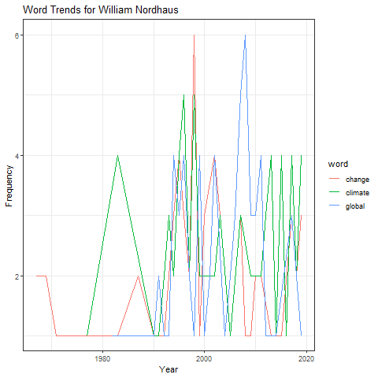

Workout 3: Report
================
Elias Junior Ghantous
November 28, 2019

``` r
library(dplyr)
```

    ## 
    ## Attaching package: 'dplyr'

    ## The following objects are masked from 'package:stats':
    ## 
    ##     filter, lag

    ## The following objects are masked from 'package:base':
    ## 
    ##     intersect, setdiff, setequal, union

``` r
library(stringr)
library(ggplot2)
library(tm)
```

    ## Loading required package: NLP

    ## 
    ## Attaching package: 'NLP'

    ## The following object is masked from 'package:ggplot2':
    ## 
    ##     annotate

``` r
library(wordcloud)
```

    ## Loading required package: RColorBrewer

``` r
library(readr)

paul_romer_df <- read.csv("../data/cleandata/paul_romer_GoogleScholarCitations.csv", stringsAsFactors = FALSE)
william_nordhaus_df <- read.csv("../data/cleandata/william_nordhaus_GoogleScholarCitations.csv", stringsAsFactors = FALSE)
```

``` r
#Start with a vowel

vowels = c("A", "E", "I", "O", "U")
beginningvowel_paul = 0
firstletters_paul = c()
for (i in 1:nrow(paul_romer_df)){
  firstletters_paul <- append(firstletters_paul, toupper(substr(paul_romer_df[i,1], 1, 1)))
}
for (i in 1:length(vowels)){
  beginningvowel_paul = beginningvowel_paul + as.numeric(table(firstletters_paul)[vowels[i]])
}

beginningvowel_william = 0
firstletters_william = c()
for (i in 1:nrow(william_nordhaus_df)){
  firstletters_william <- append(firstletters_william, toupper(substr(william_nordhaus_df[i,1], 1, 1)))
}
for (i in 1:length(vowels)){
  beginningvowel_william = beginningvowel_william + as.numeric(table(firstletters_william)[vowels[i]])
}
beginningvowel_paul
```

    ## [1] 72

``` r
beginningvowel_william
```

    ## [1] 242

For Paul Romer, 72 of his titles start with a vowel. For William Nordhaus, 242 of his titles start with a vowel, likely because he has many more papers published.

``` r
#End with 's'

lastletters_paul <- c()
for (i in 1:nrow(paul_romer_df)){
  lastletters_paul <- append(lastletters_paul, toupper(substr(paul_romer_df[i,1], nchar(as.vector(paul_romer_df[i,1])), nchar(as.vector(paul_romer_df[i,1])))))
}
as.numeric(table(lastletters_paul)["S"])
```

    ## [1] 44

``` r
lastletters_william <- c()
for (i in 1:nrow(william_nordhaus_df)){
  lastletters_william <- append(lastletters_william, toupper(substr(william_nordhaus_df[i,1], nchar(as.vector(william_nordhaus_df[i,1])), nchar(as.vector(william_nordhaus_df[i,1])))))
}
as.numeric(table(lastletters_william)["S"])
```

    ## [1] 133

For Paul Romer, 44 of his titles end with an "s". For William Nordhaus, 133 of his titles end with an "s", likely because he has many more papers published.

``` r
# longest paper title excluding languages whose characters are symbols

paul_title_lengths <- c()
for (i in 1:nrow(paul_romer_df)){
  paul_title_lengths[i] <- nchar(as.vector(paul_romer_df[i,1]))
}
paul_title_lengths_sorted <- sort(paul_title_lengths, decreasing = TRUE)
top_5_paul <- match(paul_title_lengths_sorted[1:5], paul_title_lengths)
paul_romer_df[top_5_paul,1]
```

    ## [1] "<U+041F><U+0443><U+0431><U+043B><U+0438><U+0447><U+043D><U+0438> <U+0440><U+0430><U+0437><U+0445><U+043E><U+0434><U+0438> <U+0437><U+0430> <U+043E><U+0431><U+0440><U+0430><U+0437><U+043E><U+0432><U+0430><U+043D><U+0438><U+0435> <U+0438> <U+0438><U+043A><U+043E><U+043D><U+043E><U+043C><U+0438><U+0447><U+0435><U+0441><U+043A><U+0438> <U+0440><U+0430><U+0441><U+0442><U+0435><U+0436>"
    ## [2] "How Security Service Responds to the Impact of the Social Security Law (<U+6D45><U+8C08><U+4FDD><U+5B89><U+670D><U+52A1><U+4E1A><U+5982><U+4F55><U+5E94><U+5BF9>« <U+793E><U+4F1A><U+4FDD><U+9669><U+6CD5>» <U+5B9E><U+65BD><U+7684><U+51B2><U+51FB>)"                                                                                                                                         
    ## [3] "What have we learned from a decade of empirical research on growth? Comment on ‘It's Not Factor Accumulation: Stylized Facts and Growth Models,’by William Easterly and Ross Levine"                                                                                                                                                                                                           
    ## [4] "Miembro Principal, Stanford Center for International Development y Stanford Institute for Economic Policy Research, Stanford University Paul Romer está creando una\" economía de …"                                                                                                                                                                                                           
    ## [5] "Senior Fellow, Stanford Center for International Development and Stanford Institute for Economic Policy Research, Stanford University Paul Romer is building an “economics of …"

``` r
## from the data, the 3rd title out of the top 5 is the longest valid title
longest_title_paul <- paul_romer_df[top_5_paul[3],1]

william_title_lengths <- c()
for (i in 1:nrow(william_nordhaus_df)){
  william_title_lengths[i] <- nchar(as.vector(william_nordhaus_df[i,1]))
}
william_title_lengths_sorted <- sort(william_title_lengths, decreasing = TRUE)
top_5_william <- match(william_title_lengths_sorted[1:5], william_title_lengths)
william_nordhaus_df[top_5_william,1]
```

    ## [1] "<U+041D><U+0430><U+043F><U+0440><U+044F><U+043C><U+0438> <U+0444><U+0443><U+043D><U+043A><U+0446><U+0456><U+043E><U+043D><U+0430><U+043B><U+044C><U+043D><U+043E><U+0457> <U+0442><U+0440><U+0430><U+043D><U+0441><U+0444><U+043E><U+0440><U+043C><U+0430><U+0446><U+0456><U+0457> <U+0441><U+0443><U+0431>’<U+0454><U+043A><U+0442><U+0456><U+0432> <U+043C><U+0456><U+0436><U+043D><U+0430><U+0440><U+043E><U+0434><U+043D><U+0438><U+0445> <U+0432><U+0456><U+0434><U+043D><U+043E><U+0441><U+0438><U+043D> <U+0437><U+0430> <U+0443><U+043C><U+043E><U+0432> <U+0433><U+043B><U+043E><U+0431><U+0430><U+043B><U+0456><U+0437><U+0430><U+0446><U+0456><U+0457> <U+0441><U+0432><U+0456><U+0442><U+043E><U+0432><U+043E><U+0457> <U+0435><U+043A><U+043E><U+043D><U+043E><U+043C><U+0456><U+043A><U+0438>"
    ## [2] "Cu<U+1ED1>n kinh t<U+1EBF> h<U+1ECD>c c<U+1EE7>a Paul A. Samuelson và William D. Nordhaus du<U+1EE3>c xu<U+1EA5>t b<U+1EA3>n l<U+1EA7>n d<U+1EA7>u vào nam 1948, dã du<U+1EE3>c d<U+1ECB>ch ra nhi<U+1EC1>u th<U+1EE9> ti<U+1EBF>ng và tái b<U+1EA3>n t<U+1EDB>i 15 l<U+1EA7>n. Ð<U+1ED3>ng th<U+1EDD>i du<U+1EE3>c xem là …"                                                                                                                                                                                                                                                                                                                                                                                                                                                                               
    ## [3] "Justin Mellor,\" The Negative Effects of Chemobyl on International Environ-mental Law: The Creation of the Polluter Gets Paid Principle,\" 17 Wis. Int'l LJ 65 (1999). A. Midhun …"                                                                                                                                                                                                                                                                                                                                                                                                                                                                                                                                                                                                                         
    ## [4] "Egzamin na studia drugiego stopnia stacjonarne jest egzaminem pisemnym sprawdzajacym kompetencje niezbedne do realizacji studiów magisterskich na danym kierunku. Egzamin ma …"                                                                                                                                                                                                                                                                                                                                                                                                                                                                                                                                                                                                                             
    ## [5] "Model Developments for Development of Improved Emissions Scenarios: Developing Purchasing-Power Parity Models, Analyzing Uncertainty, and Developing Data Sets for Gridded …"

``` r
## from the data, the 3rd title out of the top 5 is the longest valid title
longest_title_william <- william_nordhaus_df[top_5_william[3],1]
```

``` r
longest_title_paul
```

    ## [1] "What have we learned from a decade of empirical research on growth? Comment on ‘It's Not Factor Accumulation: Stylized Facts and Growth Models,’by William Easterly and Ross Levine"

``` r
longest_title_william
```

    ## [1] "Justin Mellor,\" The Negative Effects of Chemobyl on International Environ-mental Law: The Creation of the Polluter Gets Paid Principle,\" 17 Wis. Int'l LJ 65 (1999). A. Midhun …"

The longest title of Paul Romer is shorter than the longest title of William Nordhaus. Nordhaus' longest title isn't fully written into the website data table because it's very long.

``` r
# calculating number of punctuation symbols in titles

number_of_punctuation_symbols_paul <- c()
for (i in 1:nrow(paul_romer_df)){
  number_of_punctuation_symbols_paul[i] <- str_count(paul_romer_df[i,1], pattern = "[[:punct:]]+")
}

number_of_punctuation_symbols_william <- c()
for (i in 1:nrow(william_nordhaus_df)){
  number_of_punctuation_symbols_william[i] <- str_count(william_nordhaus_df[i,1], pattern = "[[:punct:]]+")
}

#Paul Romer punctuation summary data
summary(number_of_punctuation_symbols_paul)
```

    ##    Min. 1st Qu.  Median    Mean 3rd Qu.    Max. 
    ##   0.000   0.000   1.000   1.226   2.000   7.000

``` r
#William Nordhaus punctuation summary data
summary(number_of_punctuation_symbols_william)
```

    ##    Min. 1st Qu.  Median    Mean 3rd Qu.    Max. 
    ##   0.000   0.000   1.000   1.196   2.000  22.000

``` r
barplot(table(number_of_punctuation_symbols_paul), main = "Histogram of Punctuation Symbols in Paul Romer Titles", xlab = "number of symbols", ylab = "frequency", ylim = c(0,100))
```


``` r
barplot(table(number_of_punctuation_symbols_william), main = "Histogram of Punctuation Symbols in William Nordhaus Titles", xlab = "number of symbols", ylab = "frequency", ylim = c(0,300))
```

 William Nordhaus has more symbols in his titles than Paul Romer but the distribution they both follow is very similar, exponentially decreasing as symbols increase.

``` r
# Removing stop words, punctuations and numbers from titles and making all titles lowercase for ease of manipulation later on

stopwords = c("\\bthe\\b", "\\ba\\b", "\\ban\\b", "\\band\\b", "\\bin\\b", "\\bif\\b", "\\bbut\\b")

paperName_edited_paul <- c()
for (i in 1:nrow(paul_romer_df)){
  paperName_edited_paul[i] <- removeWords(tolower(gsub(pattern = "[[:digit:]]+|[[:punct:]]+", replacement = "", x = paul_romer_df[i,1])), stopwords)
}
#paperName_edited_paul

paperName_edited_william <- c()
for (i in 1:nrow(william_nordhaus_df)){
  paperName_edited_william[i] <- removeWords(tolower(gsub(pattern = "[[:digit:]]+|[[:punct:]]+", replacement = "", x = william_nordhaus_df[i,1])), stopwords)
}
#paperName_edited_william
```

``` r
# counting frequency of words in Paul Romer titles

words_paul <- c()
for (i in 1:length(paperName_edited_paul)){
  words_paul <- append(words_paul, strsplit(paperName_edited_paul[i], " ")[[1]])
}

words_sorted_paul <- sort(table(words_paul), decreasing = TRUE)
## after viewing words_sorted_paul, the blank spaces are the most common and so they are going to be removed from the top 10 and replaced.

words_sorted_paul <- as.data.frame((words_sorted_paul))[2:length(words_sorted_paul), ]
rownames(words_sorted_paul) <- c()
colnames(words_sorted_paul) <- c("words", "frequency")

# top 10 most used words for Paul Romer
head(words_sorted_paul, 10)
```

    ##          words frequency
    ## 1           of        82
    ## 2       growth        68
    ## 3     economic        41
    ## 4          for        26
    ## 5         with        24
    ## 6   endogenous        21
    ## 7           to        18
    ## 8           on        13
    ## 9  development        12
    ## 10     returns        12

These are the 10 most frequent words in Paul Romer's titles.

``` r
# counting frequency of words in William Nordhaus titles

words_william <- c()
for (i in 1:length(paperName_edited_william)){
  words_william <- append(words_william, strsplit(paperName_edited_william[i], " ")[[1]])
}

words_sorted_william <- sort(table(words_william), decreasing = TRUE)
## after viewing words_sorted_william, the blank spaces are the most common and so they are going to be removed from the top 10 and replaced.

words_sorted_william <- as.data.frame((words_sorted_william))[2:length(words_sorted_william), ]
rownames(words_sorted_william) <- c()
colnames(words_sorted_william) <- c("words", "frequency")

# top 10 most used words for Paul Romer
head(words_sorted_william, 10)
```

    ##        words frequency
    ## 1         of       318
    ## 2   economic        87
    ## 3    climate        78
    ## 4  economics        77
    ## 5         on        73
    ## 6     global        72
    ## 7     change        67
    ## 8    warming        61
    ## 9        for        58
    ## 10        to        55

These are William Nordhaus' top 10 words. "Of" and "economic" both show up in the top 3 for both authors.

 The wordcloud for Paul Romer shows that very few words are used very frequently while most words are used around the same number of times.

 The wordcloud for William Nordhaus shows that very few words are used very frequently while most words are used around the same number of times. The distribution of frequency of words used is very similar for both authors.

 William Nordhaus began publishing papers much earlier than Paul Romer. Both authors have steadily increased the numbers of paper published per year until a point where the papers published started decreasing. There are multiple peaks every 10 years or so. Nordhaus published the most papers in 2000 while Romer's highest was 1990. Nordhaus exceeded Romer in papers published almost every year.

 Paul Romer's use of three buzzwords "economic", "growth" and "endogenous", spiked repeatedly until 1994 after which the use of these words tailed off. The highest frequency of all words in the graph was "growth" which was used 7 times in 1994.

 William Nordhaus would use a word around 4 times per year in his titles. The highest frequency of all words in the graph was "change" and "global", both used 6 times at their peak. The word usage for Nordhaus shows more activity 1995 onwards.

``` r
# counting number of co-authors for Paul Romer

total_coauthors_paul <- 0

for (i in 1:nrow(paul_romer_df)){
  total_coauthors_paul <- total_coauthors_paul + str_count(paul_romer_df$researcher[i], pattern = ",")
}

mean_coauthors_paul <- total_coauthors_paul/nrow(paul_romer_df)
mean_coauthors_paul
```

    ## [1] 1.367257

``` r
# counting number of co-authors for William Nordhaus

total_coauthors_william <- 0

for (i in 1:nrow(william_nordhaus_df)){
  total_coauthors_william <- total_coauthors_william + str_count(william_nordhaus_df$researcher[i], pattern = ",")
}

mean_coauthors_william <- total_coauthors_william/nrow(william_nordhaus_df)
mean_coauthors_william
```

    ## [1] 1.271117

On average, Paul Romer edges out William Nordhaus when it comes to average number of coauthors which could show that Romer is more willing to work with other researchers than Nordhaus.

``` r
# Checking if the two authors have worked together on a paper

paul_and_william <- str_detect(paul_romer_df$researcher, pattern = "\\bNordhaus\\b")

paul_and_william_papers <- paul_romer_df[which(paul_and_william %in% TRUE),]
paul_and_william_papers
```

    ##                                                                            paperName
    ## 154 The Sveriges Riksbank Prize in Economic Sciences in Memory of Alfred Nobel, 2018
    ## 213                                                                      TRIVIA QUIZ
    ##                                           researcher
    ## 154                            WD Nordhaus, PM Romer
    ## 213 JC Bogle, JL Yellen, W Nordhaus, P Romer, F Bank
    ##                                                      journal citations year
    ## 154 SCANDINAVIAN JOURNAL OF ECONOMICS 121 (3), 857-858, 2019        NA 2019
    ## 213                                                                 NA   NA

The two authors have, in fact, worked together on research in the past.

``` r
# paper with the most coauthors for Paul Romer

number_of_coauthors_paul <- c()

for (i in 1:nrow(paul_romer_df)){
  number_of_coauthors_paul[i] <- str_count(paul_romer_df$researcher[i], pattern = ",")
}

paul_romer_df[which.max(number_of_coauthors_paul), ]
```

    ##                                 paperName
    ## 210 Introduction to Spatial Econometrics.
    ##                                                                      researcher
    ## 210 X Zhen, S Fen, W Petty, W Petty, A Smith, TW Schultz, H Uzawa, R Lucas, ...
    ##                                                         journal citations year
    ## 210 Information Technology Journal 12 (10), pp: 66-pp: 66, 1981        NA 1981

This is Paul Romer's paper in which he had the most coauthors.

``` r
# paper with the most coauthors for William Nordhaus

number_of_coauthors_william <- c()

for (i in 1:nrow(william_nordhaus_df)){
  number_of_coauthors_william[i] <- str_count(william_nordhaus_df$researcher[i], pattern = ",")
}

william_nordhaus_df[which.max(number_of_coauthors_william), ]
```

    ##                                                paperName
    ## 642 Keeping kosher: the epistemology of tax expenditures
    ##                                                                    researcher
    ## 642 R Rose, T Karran, R Rose, T Karran, H Aaron, JE Alt, JE Alt, S Anson, ...
    ##                                                                                  journal
    ## 642 Taxation by Political Inertia: Financing the Growth of Government in Britain …, 1987
    ##     citations year
    ## 642        NA 1987

This is William Nordhaus' paper in which he had the most coauthors.

``` r
# number of distinct journals in Paul Romer table

journal_paul_logical <- str_detect(toupper(paul_romer_df$journal), pattern = "\\bJOURNAL\\b")

number_of_unique_journals_paul <- length(unique(paul_romer_df$journal[which(journal_paul_logical %in% TRUE)]))
number_of_unique_journals_paul
```

    ## [1] 42

``` r
# number of distinct journals in William Nordhaus table

journal_william_logical <- str_detect(toupper(william_nordhaus_df$journal), pattern = "\\bJOURNAL\\b")

number_of_unique_journals_william <- length(unique(william_nordhaus_df$journal[which(journal_william_logical %in% TRUE)]))
number_of_unique_journals_william
```

    ## [1] 64

Paul Romer is published in 42 different journals. William Nordhaus is published in 64 different journals. This could show a broader level of expertise for Nordhaus as he is published in many more different journals that could span slightly different topics and fields.

``` r
# citations for each journal - Paul Romer

journals_paul_df <- paul_romer_df[which(journal_paul_logical %in% TRUE),]
journals_paul_df$journal <- factor(journals_paul_df$journal)
journals_paul_df_citations <- summarise(group_by(journals_paul_df, journal), total_citations = sum(citations, na.rm = FALSE))

journals_paul_df_citations
```

    ## # A tibble: 42 x 2
    ##    journal                                                       total_citations
    ##    <fct>                                                                   <int>
    ##  1 American Economic Journal: Macroeconomics 2 (1), 224-45, 2010             613
    ##  2 City Journal 20 (4), 2010                                                  12
    ##  3 Econometrica: Journal of the Econometric Society, 897-908, 1~             102
    ##  4 Information Technology Journal 12 (10), pp: 66-pp: 66, 1981                NA
    ##  5 Information Technology Journal 8 (5), 633-653, 1996                        NA
    ##  6 Journal of Applied Corporate Finance 11, 2, 1998                            5
    ##  7 Journal of Applied Corporate Finance 11, 8-27, 1998                        30
    ##  8 Journal of Applied Sciences 10 (4), pp: 45-71-pp: 45-71, 2008              NA
    ##  9 Journal of Applied Sciences 13 (20), 155-173, 1962                         NA
    ## 10 Journal of Applied Sciences 15 (2), 41-47, 1978                            NA
    ## # ... with 32 more rows

These are Romer's citation counts for each journal. Some are NA as there is no data on the citation number for these journals.

``` r
# citations for each journal - William Nordhaus

journals_william_df <- william_nordhaus_df[which(journal_william_logical %in% TRUE),]
journals_william_df$journal <- factor(journals_william_df$journal)
journals_william_df_citations <- summarise(group_by(journals_william_df, journal), total_citations = sum(citations, na.rm = FALSE))

journals_william_df_citations
```

    ## # A tibble: 64 x 2
    ##    journal                                                       total_citations
    ##    <fct>                                                                   <int>
    ##  1 American Bar Association Journal 69 (11), 1724-1724, 1983                  NA
    ##  2 American Economic Journal: Economic Policy 10 (3), 333-60, 2~              87
    ##  3 American Journal of Economics and sociology 64 (1), 367-392,~              70
    ##  4 Cambridge Journal of Economics 3 (2), 153-163, 1979                        44
    ##  5 Economic Journal 101, 407, 1991                                            28
    ##  6 Economic Journal 125 (583), 603-620, 2015                                   1
    ##  7 Economic Journal 82 (327), 853-882, 1972                                  211
    ##  8 Economic Journal, 1991                                                     NA
    ##  9 Energy Journal-Cleveland 16 (2), 132-134, 1995                              9
    ## 10 International Social Science Journal 35 (3), 493-506, 1983                  1
    ## # ... with 54 more rows

These are Nordhaus' citation counts for each journal. Some are NA as there is no data on the citation number for these journals.

``` r
# most influential journal

arrange(journals_paul_df_citations, desc(total_citations))
```

    ## # A tibble: 42 x 2
    ##    journal                                                       total_citations
    ##    <fct>                                                                   <int>
    ##  1 Journal of political Economy 98 (5, Part 2), S71-S102, 1990             29455
    ##  2 Journal of political economy 94 (5), 1002-1037, 1986                    27658
    ##  3 Journal of Economic perspectives 8 (1), 3-22, 1994                       4964
    ##  4 The Quarterly Journal of Economics 106 (2), 531-555, 1991                2698
    ##  5 Journal of monetary economics 32 (3), 543-573, 1993                      1709
    ##  6 Journal of development Economics 43 (1), 5-38, 1994                      1099
    ##  7 American Economic Journal: Macroeconomics 2 (1), 224-45, 2010             613
    ##  8 Econometrica: Journal of the Econometric Society, 897-908, 1~             102
    ##  9 Journal of Economic Theory 50 (1), 1-21, 1990                              90
    ## 10 Journal of Political Economy 94 (5), 1002-1037, 1986                       61
    ## # ... with 32 more rows

``` r
arrange(journals_william_df_citations, desc(total_citations))
```

    ## # A tibble: 64 x 2
    ##    journal                                                       total_citations
    ##    <fct>                                                                   <int>
    ##  1 Journal of economic literature 45 (3), 686-702, 2007                     2596
    ##  2 The Energy Journal 18 (1), 1997                                          1735
    ##  3 The economic journal 101 (407), 920-937, 1991                            1643
    ##  4 The Energy Journal, 37-65, 1991                                           473
    ##  5 The Economic Journal 83 (332), 1156-1183, 1973                            404
    ##  6 Journal of the Association of Environmental and Resource Eco~             287
    ##  7 The Energy Journal, 93-130, 1999                                          284
    ##  8 Journal of economic Perspectives 7 (4), 11-25, 1993                       247
    ##  9 The BE Journal of Macroeconomics 8 (1), 2008                              230
    ## 10 The Journal of Economic History 67 (1), 128-159, 2007                     228
    ## # ... with 54 more rows

In their academic field, for Romer, the "Journal of Political Economy" is the most influential as it attains the top two spots. For Nordhaus, "The Energy Journal" attains two of the top 5 spots and is repeatedly cited in different volumes later on and so it is the most influential.
